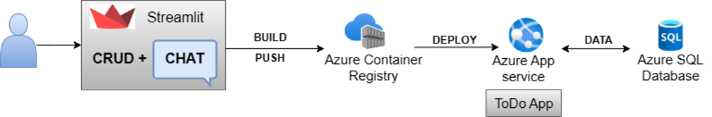
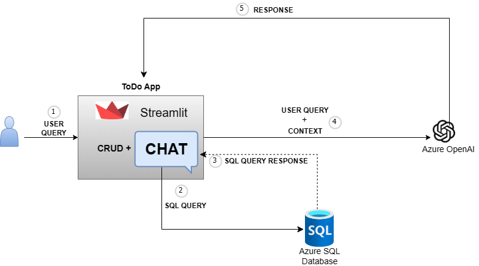

# TaskGPT

## Introduction

This is a Streamlit-based ToDo application that incorporates:

1. CRUD functionalities
2. Chat feature integrated with Azure OpenAi

## Prerequisites

1. [Login to Azure Portal](https://portal.azure.com/)

2. [Create an Azure Resource Group](https://docs.microsoft.com/en-us/azure/azure-resource-manager/management/manage-resource-groups-cli#create-resource-groups)

3. [Create an Azure SQL Database](https://learn.microsoft.com/en-us/azure/azure-sql/database/single-database-create-quickstart?view=azuresql&tabs=azure-portal)

    Once the Azure SQL Database is created: Copy the value of database server, database name, database username, database password for later use.

4. [Create an Azure OpenAi](https://learn.microsoft.com/en-us/azure/ai-services/openai/how-to/create-resource?pivots=web-portal#create-a-resource)

    Once Azure OpenAi is created: Copy the value of OpenAi key and OpenAi endpoint for later use.

## Architecture flow of the Application

### ToDo Flow



### Chat Flow with OpenAi



## Technologies used

1. Streamlit
2. Azure Container Registry
3. Azure App Service
4. Azure SQL Database
5. Azure OpenAi

## Getting Started

### Steps

1. Clone this github repository into your local machine and open it in VS code.

2. Setup environment variables:

    - Create an environment file ".env" file by copying the contents from [env_template](.env_template) file.
    - Fill in the values for Azure SQL Database credentials and Azure OpenAi credentials in ".env" file that you noted down while creating Azure SQL Database and Azure OpenAi earlier. 

3. To run the application locally, follow the command: 

    ```streamlit run main.py```

4. You will see that the application starts running on the local host with port number "8501":  

    ```http://localhost:8501```


### You can also deploy the application using various ways:

- Streamlit community cloud
- Azure App Service
- Docker
- Kubernetes
